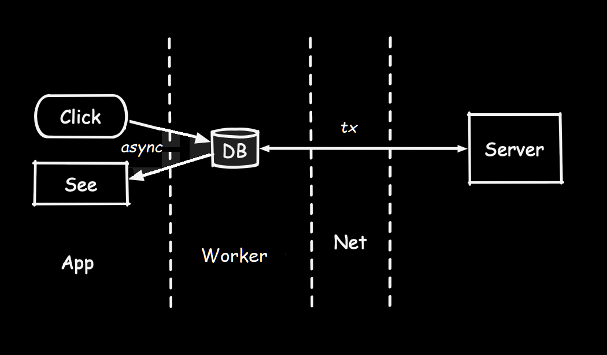
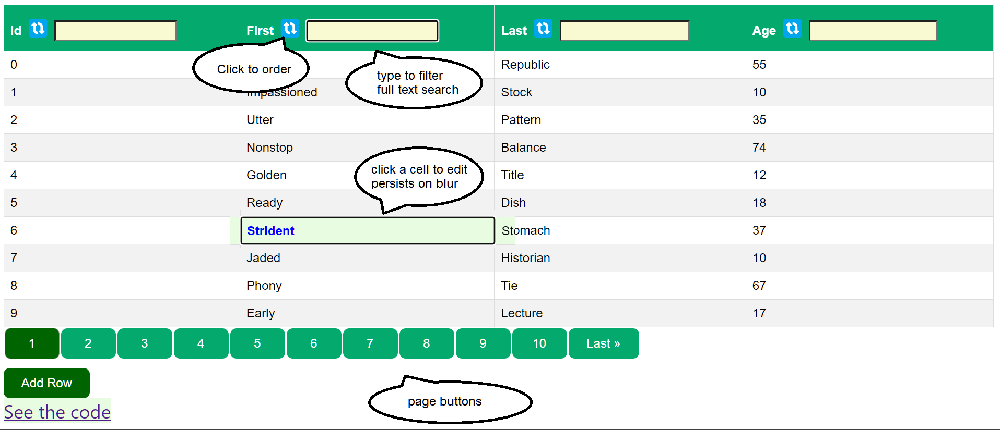
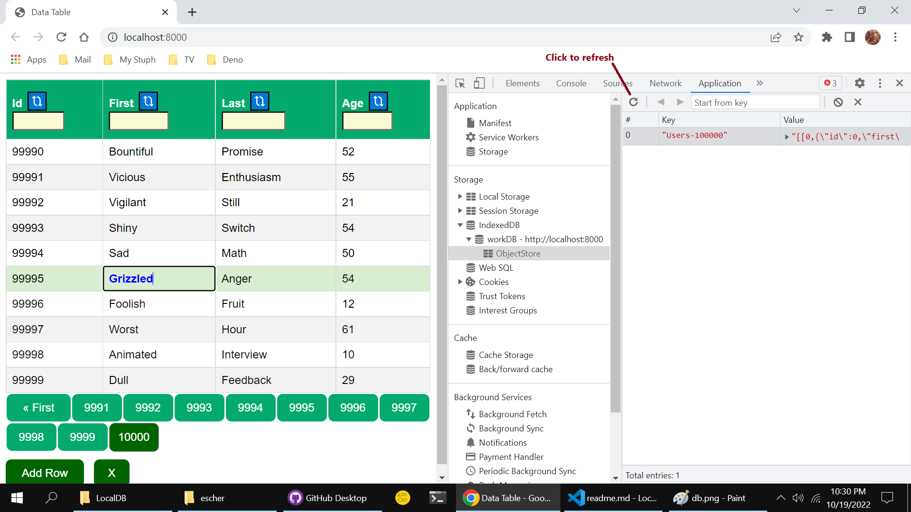

# BuenoCache
## A _LocalFirst_ example application
  - Pure vanilla HTML, CSS, javascript application - no frameworks
  - Local async transaction-based IndexedDB persistence service
  - Zero dependencies -- None, Nada
  - Zero network requirements, statically served from Github Pages



## 100K user objects
This BuenoCache example persists a collection of 100k _user-objects_ in an IndexedDB    
  - Note: this cache service with proper transactions in place, will work with almost any persitence service.  I've used localStorage, IndexedDB, SQLite, and DenoKv. To insure cache consistentency, all DB-mutations must be wrapped in a transaction. 

### Instantaneous ordering, filtering, pagination

BuenoCache is an extremely performant in-memory data service.     
This example serves a collection of 100k _user-objects_ persisted in a local IndexedDB.    

### Click the link or image below to run this demo:   
https://nhrones.github.io/Hot_BuenoCache/ 

  - This will run the app from Github Pages.    
  - The app will first build then hydrate an IndexedDB -> workDB -> ObjectStore    
  - Any mutation of the bueno-cache will be consistently persisted to this ObjectStore

[](https://nhrones.github.io/Hot_BuenoCache/)


## About this Proof Of Concept demo

 - All data is persisted and hydrated as a single key-value record in IndexedDB.    
 - The IndexedDB is managed by a worker thread. See: _./workers/idbWorker.js_    
 - Data hydrates to an es6-Map (bueno-cache) using JSON.parse()    
 - The bueno-cache data is persisted in IndexedDB using JSON.stringyfy()    
 - Any mutation to bueno-cache triggers a flush of the full dataset to IndexedDB.    
 - You'll notice a very resposive UI, as most data ops are on a worker thread.    
 - I've tested with 5 million records with no IDB or UI issues.    

This example app demonstrates full **CRUD** of the 100k user objects:
```js
/** a `User` object ...*/
User = {
    id: number,     // index
    first: string,  // ~ 6 char 
    last: string,   // ~ 6 char 
    age: number     // 10 - 70
} 

/**
 * Hydrate from the IndexedDB worker 
 * one hundred thousand `stringyfied` User objects
 * @ param hundredK =~ 6 million chars - 7.6 MB
 */
worker.onmessage(hundredK) =>
   buenoCache = new Map([...JSON.parse(hundredK)])

// Persist to the IndexedDB worker
worker postMessage(id, value = JSON.stringify([...buenoCache.entries()]))
```

## Note -> Devtools_Hot app: 
This app has been bundled with esBuild (automatically within HotServe)!    
The app is architected for, and prefers to run from **_Devtools_Hot_**
See: https://github.com/nhrones/Devtools_Hot

It will also run from any other dev server from the /dist/ folder.     

If not using Devtools_Hot, The included utility _./builder.ts/_ can be used to manually rebuild as needed.
```
> deno run -A --quiet builder.ts
```
This will refresh the _./dist/bundle.js/_ file.

## Observed performance

You can appreciate the performance of this persisted cache, by deleting the IndexedDB dataset while the app is running.    
On the next mutation operation of bueno-cache, the app will reconstruct the original  IndexedDB demonstration store.   
This is imperceptible to the UX, as this is mostly off-UI-thread.   
    
If you once again delete the IndexedDB, and then _refresh the page_, you'll see a     
_creation_ message on restart. It will take < 250ms to recreate and persist    
a _new_ set of (100,000 user objects, ~ 7.6 MB in IDB).    
  
### With the app running:     
   Open dev-tools        
   Open the Application tab    
   Select the storage/indexedDB -> workDB -> ObjectStore  
   You'll see one or more keys _Users-xxxx_ (xxxx = number of  user objects)    
   You may then right-click on a _key_ and select delete to remove it.    
   This will not impact the running app.  Any Create, Update, or Delete op,    
   will force a flush of the buenoCache to the IndexedDB record.    
   A flush takes < 100ms for 100k user objects, most of this time is in the worker.   
   To see the newly created data, press the idb refresh button in devtools.  
   See the red arrow below.      
   

   ## Editing data
   The table headers allow _ordering_ and _filtering_ on each column. 
   Table cells are editable. 
   Any _cell-blur_, forces a mutation of the buenoCache. This mutation then forces a DB flush. 
   Note: the _id_ cell (primary key) (index) is not editable.
   Filtering a column uses a full-text search of the full 100k users.
   You can order the filtered set with the icon to the left of the inputbox.
   Whenever you _select_ a cell in a row, the row and cell will be highlighted, and a _delete_ button (**X**) will be shown next to the 'Add Row' button.    
   You can _click_ this button to delete the currently selected row. 
   Use the 'Add Row' button (bottom-left) to add a new data row.  
 


 
   ## About the UI
   The table headers allow _ordering_ and _filtering_ on each column.    
   Please note the performance of the es6-Map-based cache.     
   Ordering and filtering are always applied to the full 100,000 user records.   
   Because all cache _mutations_ are immediately flushed to IndexedDB, the buenoCache remains consistant.      
   Have fun! I learned quite a bit building this.   
   
   ## What I've learned:
   The thing that impressed me the most, is how _incredibly fast_ V8-JSON is!    
   I was also impressed with how well _es6-Maps_ work as a database cache.    
   I've tried many different data transfer methods between the ui-thread and the worker, and was surprised that transfering / persisting a single json string is extremely efficient.
