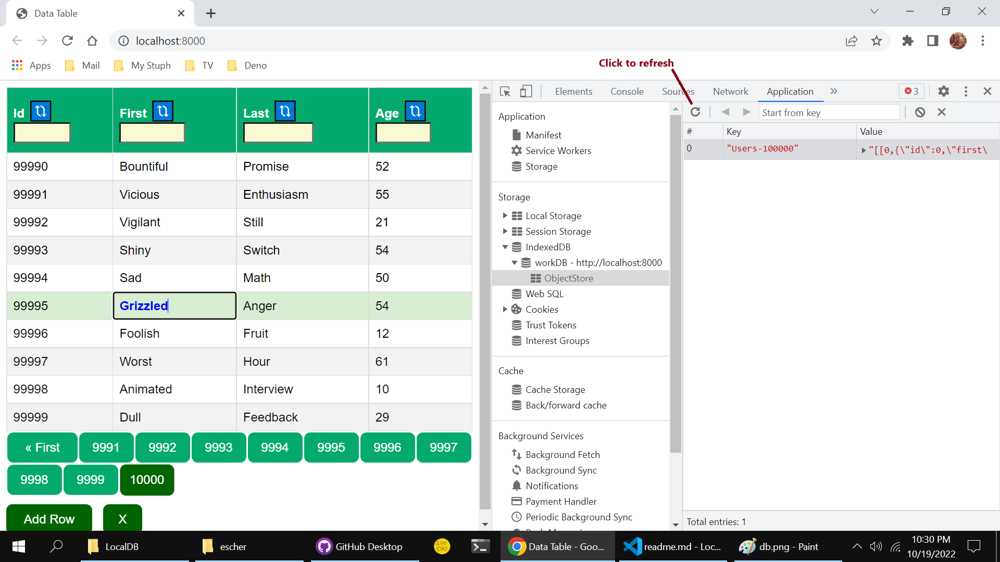

# BuenoCache

This BuenoCache example persists a collection of _user-objects_ in an IndexedDB    
  - Note: this cache service with proper transactions in place, will work with almost any persitence service.  I've used localStorage, IndexedDB, SQLite, and DenoKv.  To insure consistent cache, all DB-mutations must be wrapped in a transaction. 

### Click the link below to run this demo:   

https://nhrones.github.io/BuenoCache/    
  - This will run the app from Github Pages.    
  - The app will first build then hydrate an IndexedDB -> workDB -> ObjectStore    
  - Any mutation of the data will be consistently persisted to this ObjectStore


## About this Proof Of Concept demo

 - All data is persisted and hydrated as a single key-value record in IndexedDB.    
 - The IndexedDB is managed by a worker thread. See: _./worker/idbWorker.js_    
 - Data hydrates to an es6-Map using JSON.parse()    
 - The Map data is persisted using JSON.stringyfy()    
 - Any mutation to buenoCache triggers a flush of the full dataset to IndexedDB.    
 - You'll notice a very resposive UI, as most data ops are on a worker thread.    
 - I've tested with 5,000,000 records with no IndexedDB or UI issues.    

This example app demonstrates full **CRUD** of 100,000 user objects:
```js
/** a `User` object ...*/
User = {
    id: number,     // index
    first: string,  // ~ 6 char 
    last: string,   // ~ 6 char 
    age: number     // 10 - 70
} 

/**
 * Hydrate from the IndexedDB worker 
 * one hundred thousand `stringyfied` User objects
 * @ param hundredK =~ 6 million chars - 7.6 MB
 */
worker.onmessage(hundredK) =>
   buenoCache = new Map([...JSON.parse(hundredK)])

// Persist to the IndexedDB worker
worker postMessage(id, value = JSON.stringify([...buenoCache.entries()]))
```

## Note: 
This app has been bundled with esBuild (automatically in HotServe)!    
The app prefers to run from **_Hot-Serve_** https://github.com/nhrones/Hot     
It will also run from any other dev server.     

The included utility _./builder.ts/_ can be used to rebuild when needed.
```
> deno run -A --quiet builder.ts
```
This will refresh the _./dist/bundle.js/_ file.

## Observed performance
You can appreciate the performance of this persisted cache, by deleting the IndexedDB     
dataset while the app is running.    
On the next mutation operation of buenoCache, the app will reconstruct the IndexedDB row.   
This is imperceptible to the UX, as this is mostly off-UI-thread.   
    
If you then again delete the IndexedDB row, and then _refresh the page_, you'll see a     
_creation_ message on restart. It will take < 250ms to create and persist    
a _new_ set of (100,000 user objects, ~ 7.6 MB in IDB).    
  
### With the app running:     
   Open dev-tools        
   Open the Application tab    
   Select the storage/indexedDB -> workDB -> ObjectStore    
   You'll see one or more keys _Users-xxxx_ (xxxx = number of  user objects)    
   You may then right-click on a _key_ and select delete to remove it.    
   This will not impact the running app.  Any Create, Update, or Delete op,    
   will force a flush of the buenoCache to the IndexedDB record.    
   A flush takes < 100ms for 100k user objects, most of this time is in the worker.   
   
   Note: Table cells are editable.     
   Any _cell-blur_, forces a mutation of the buenoCache.  This mutation then forces 
   a DB flush. Note that the _id_ cell is not editable.

   Whenever you _select_ a cell in a row, the row and cell will be highlighted.   
   Also, a _delete_ button (**X**) will show at the botton on the table.    
   You can _click_ this button to delete the selected row.   
 
   See the red arrow below.    
        
   
   
   ## About the UI
   The table headers allow _ordering_ and _filtering_ on each column.    
   Please note the performance of the es6-Map-based cache.     
   Ordering and filtering are always applied to the full 100,000 user records.   
   Because all cache _mutations_ are immediately flushed to IndexedDB, the buenoCache remains consistant.      
   Have fun! I learned quite a bit building this.   
   
   ## What I've learned:
   The thing that impressed me the most, is how _incredibly fast_ V8-JSON is!    
   I was also impressed with how well _es6-Maps_ work as a database cache.    
   I've tried many different data transfer methods between the ui-thread and the worker.     
   I was surprised that transfering / persisting a single json string is extremely efficient.